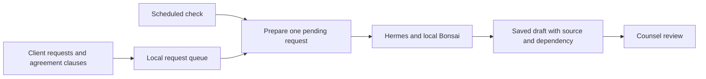
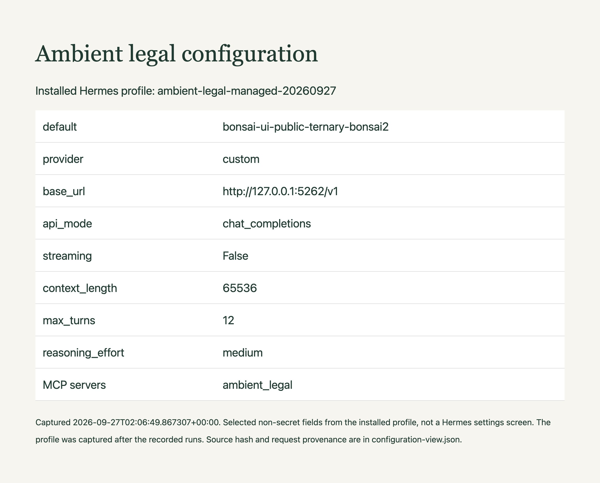

# Prepare client requests for counsel's next review

Give counsel a draft that already includes the governing clause, unresolved dependency and proposed follow-up. A scheduled agent prepares one pending request at a time, so counsel can begin the review with the source and decision together.

## What the reviewer receives

The sample requests cover workshop planning, escalation coverage, recording retention and acceptance deadlines. In the recorded scheduled run, the agent saved a 168-word retention draft citing the controlling amendment and October 6 deadline. Counsel can inspect the packet and record a decision before anyone acts on it.

The [recorded scheduled run](evidence/managed-launchd-20260927/README.md) includes the saved draft, source record, request usage and verification results.

## How preparation works



Preparing a request manually means finding the current clause and establishing what information is missing before drafting a response. The scheduled workflow preserves that preparation beside the request. A rules-only queue is enough to sort dates; the model is used to explain the obligation and propose a follow-up. Keeping review decisions outside its tools gives counsel a clear point to exercise judgment.

The [architecture walkthrough](docs/architecture.md) explains the components, persistence and failure handling. Hermes runs the agent loop, while the local Bonsai endpoint supplies reasoning and tool selection. The scheduler and application code control when work starts and what gets saved.

## Try the sample workflow

```sh
git clone https://github.com/ChaiWithJai/bonsai-hermes-ambient-legal.git
cd bonsai-hermes-ambient-legal
python3 -m unittest discover -s tests -v
export AMBIENT_DB="$(mktemp -d)/requests.sqlite"
python3 ambient.py tick --as-of 2026-09-26
python3 ambient.py packets
```

The first tick creates four sample packets, and repeating it leaves them unduplicated. This step exercises queue preparation without inference. Follow the [setup guide](docs/setup.md) to add Hermes and Bonsai, then the [managed service guide](docs/managed-service.md) to start inference automatically for pending work. The Mac must remain awake with the user logged in. The [Google intake guide](docs/connected-intake.md) imports a selected commitment and its agreement into the same queue.

## Why these model settings

Bonsai supplies the language reasoning and tool selection; the application checks the facts it can verify in code. The reference run uses Ternary Bonsai 2 27B in PQ2_0 format on an M5 Pro with 48 GiB of memory. The model and matching Prism runtime are a reproducible starting point for a workstation deployment.

The [parameter guide](docs/parameter-guide.md) explains temperature, sampling, context, reasoning budget and tool limits, with sources and a task-specific evaluation plan. The settings follow the publisher's thinking-mode guidance. The workflow has been exercised with them, but a controlled comparison has not established an optimal configuration for legal or finance work.



The [configuration record](docs/recorded-configuration.md) identifies the profile and request fields used to produce this reference view.

## Find the code and extend it

| Location | What to change |
| --- | --- |
| `ambient.py` | Queue, packet persistence, review decisions and MCP tools. |
| `managed_tick.py`, `run_review.py` | Scheduled model lifecycle and draft verification. |
| `config/` | Agent instructions, tools and sampling. |
| `fixtures/` | Sample requests, clauses and submission format. |
| `scripts/` | Google intake, date context and usage export. |
| `tests/` | Source, persistence and scheduling regression checks. |
| `docs/`, `evidence/` | Operating guides and recorded runs. |

Run `python3 -m unittest discover -s tests -v` after changing the workflow. Keep generated drafts and runtime state in their configured data directories; the source checkout contains the implementation and sample inputs.
